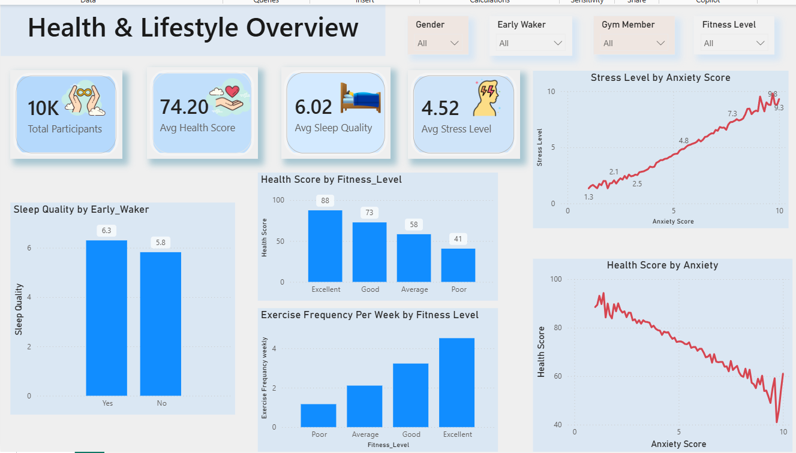

# Health-and-Lifestyle-Data-Analysis

## 📌 Project Overview

This project analyzes a health and lifestyle dataset to explore relationships between lifestyle habits, physical fitness, sleep, mental well-being, and overall health.

The analysis was performed using Python for exploratory data analysis (EDA) and Power BI for creating an interactive dashboard. The goal of this project is to identify meaningful patterns and understand the factors associated with overall health and well-being.

## 📊 Dataset Overview

The dataset contains 10,000 records and 65 features covering different aspects of health and lifestyle.

The features include:
- Demographic information such as age and gender
- Sleep habits and sleep quality
- Exercise frequency and fitness level
- Diet and daily lifestyle habits
- Stress and anxiety levels
- Physical health indicators
- Overall health score

This dataset was used to explore how different lifestyle and well-being factors are associated with overall health.

## 🛠️ Tools & Technologies

- **Python** - Data cleaning and exploratory data analysis
- **Pandas** - Data manipulation and analysis
- **Matplotlib** - Data visualization
- **Seaborn** - Statistical data visualization
- **Power BI** - Interactive dashboard creation
- **Jupyter Notebook** - Python analysis environment

## 🔍 Data Cleaning & Exploratory Data Analysis

The dataset was explored and analyzed using Python to understand its structure, quality, and relationships between different health and lifestyle variables.

### Data Cleaning
- Checked the dataset structure, data types, and dimensions
- Identified missing values and duplicate records
- Reviewed numerical and categorical features
- Prepared the data for further analysis and visualization

### Exploratory Data Analysis
- Analyzed distributions of key variables such as age, BMI, and sleep duration
- Compared sleep quality between early and non-early wakers
- Analyzed health scores across different fitness levels
- Explored exercise frequency across fitness levels
- Examined relationships between anxiety, stress, and health scores
- Used correlation analysis to identify relationships between numerical variables

## 📊 Power BI Dashboard

An interactive Power BI dashboard was created to visualize key health and lifestyle patterns identified during the analysis.

## 🔑 Key Findings

- Higher anxiety levels were associated with higher stress levels.
- Health scores showed a decreasing trend as anxiety levels increased.
- Individuals with excellent fitness levels had the highest average health scores.
- Exercise frequency tended to be higher among individuals with better fitness levels.

## 📝 Conclusion

This project explored relationships between lifestyle habits, mental well-being, fitness, and overall health. The analysis highlighted notable patterns involving anxiety, stress, fitness, exercise, and health scores.

The project demonstrates the use of Python for exploratory data analysis and Power BI for presenting findings through an interactive dashboard.

### ❤️😂😊😊😒😒
